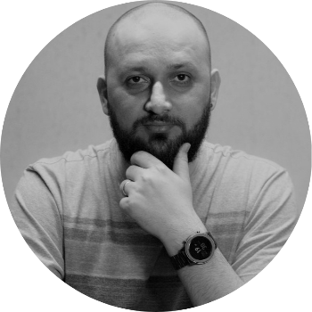

# Hi there 👋

<!--
**zenatuz/zenatuz** is a ✨ _special_ ✨ repository because its `README.md` (this file) appears on your GitHub profile.

Here are some ideas to get you started:

- 🔭 I’m currently working on ...
- 🌱 I’m currently learning ...
- 👯 I’m looking to collaborate on ...
- 🤔 I’m looking for help with ...
- 💬 Ask me about ...
- 📫 How to reach me: ...
- 😄 Pronouns: ...
- ⚡ Fun fact: ...
-->
Hi there, My name is Renato, I'm glad to see you here.

<!--  -->

<!--  -->

<!--  -->

 
 
 
 
 
 
 
 
 

## About me
I have been working with infrastructure since **2009**, I have been through Governmental, TV, industry, and commerce sectors, both in Brazil and abroad.

I went to Asia in **2014** to work for the government of Timor-Leste on a **UN mission**, at the same time, the opportunity allowed me to improve my English and discover my taste for traveling.

I returned to Brazil in **2017**, **focusing on working with DevOps**, disseminating a culture for teams of different skills, teaching and implementing good practices, testing new technologies and forms of digital optimization.

I am a lover of technology, coffee, and RPG. Curious and ready to face any challenge. Hobbies, video games, and games, in general, have a reserved space; science fiction and fantasy books, films, and series are my favorite genres.

I’m currently learning more about IaC, Azure, Kubernetes, Microservices, Digital Optimization.

## Get in touch
To get to know my professional side, follow my profile on [Linkedin](https://linkedin.com/in/renato-r-batista), which has everything detailed there.
If you want to see my funny side, follow me on [Instagram](https://instagram.com/zenatuz).

Once in a while, I write some articles on my blog, [RenatoBatista.com.br](https://renatobatista.com.br).

Hope to get in touch 😉.
